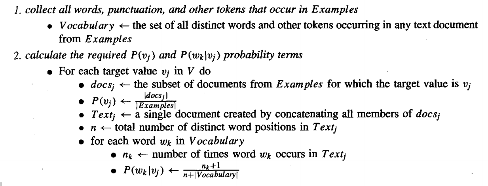

# naivebayes
This is my Java implementation of the Naive Bayes Classifier. 

Here is the pseudocode from the book I referred to, titled "Machine Learning" by Tom Mitchell. I did not however implement the steps to calculate P(v). I used a uniform distribution instead.

